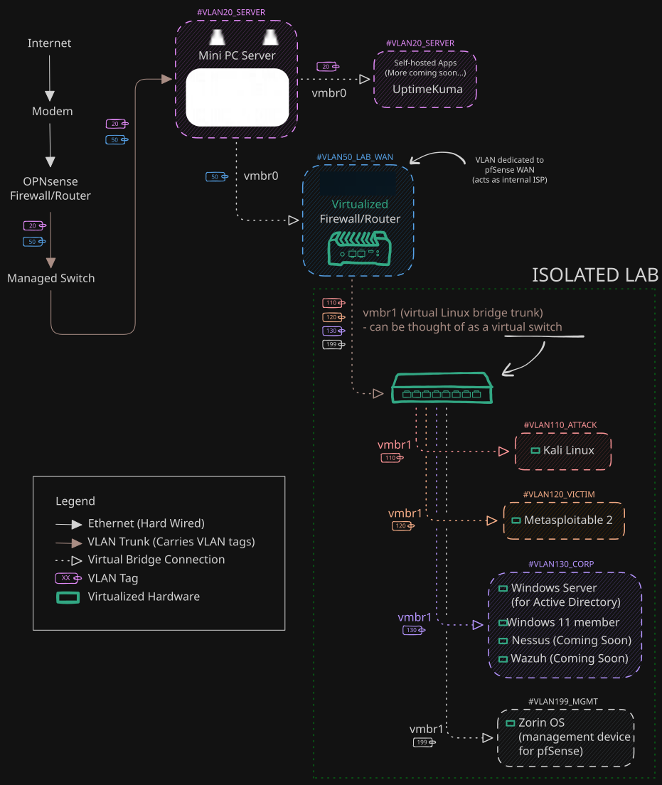

## Project Overview

The goal was to build a home server that serves as both a learning environment and a platform for self-hosting various apps. This lab will assist in my journey as I learn more about ethical hacking, sys admin, and more.

## Lab Architecture

I wanted to create a more real-world IT environment, not simply a few virtual machines (like a Kali attacker and a victim machine). I chose to install Proxmox hypervisor on a power-efficient mini PC.

To isolate the hacking lab from my main network, I virtualized pfSense, serving as a nested firewall/router for the lab. I also configured VLANs to segment various systems from each other.

### Network Topology

## Implementation

### More info coming soon...

<!--  -->

## Future Improvements

- Set up Wazuh to practice using SIEM (Security Information and Event Management).
- Add a NAS (Network Attached Storage) for backups and self-hosted cloud storage.
