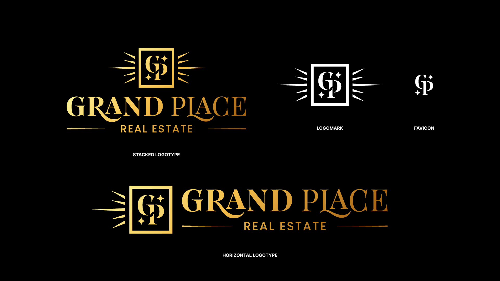

import { Image } from "astro:assets";
import gpStackedLogo from "../../assets/images/grand_place/GrandPlace_StackedLogo.svg";
import gpLogosCaseStudy from "../../assets/images/grand_place/GrandPlace_Logos_CaseStudy.webp";

<Image
  src={gpStackedLogo}
  alt="Grand Place stacked logotype"
  loading="eager"
  class="pad-bottom"
/>

Grand Place Real Estate is a growing team with a mission to fulfill their clients' goals with seamless and trusting service. After years of working under Keller Williams, it became clear to the owners that they needed to distinguish themselves from other teams at KW. Their brand was unrecognizable beyond the parent brokerage. Many realtors face this because they rely on templates for their brand, which results in everyone blending in with the competition.

The Solution

With a new identity, they wanted their brand to target a luxury market while still being approachable to first-home buyers. We worked together to create a full branding package, with collaborative review at each step of the process.

The brand identity needed to:

Represent their professional image: modern, clean, premium, transparent.
Appeal to high-end clients without feeling overly exclusive.
Provide a polished experience that spans across all aspects of the business.

Brand Naming

Previously operating under their last name, I worked with the founders, George & Page, to rename their company. The old name was difficult to remember, and they wanted a name that embraced them as they expanded their team.

We aimed for an ownable name that evokes both luxury and warmth—something they'd feel proud of—eventually landing on Grand Place. As an added charm, the owners love that their new business name happens to include their initials, G + P.

Logo, Type & Color
I started with concept sketches, exploring many ideas and refining them into a few of the best options to present to the client.

I knew I wanted to explore an option that emphasizes the founders' initials within the business name. I solved this with a custom 'GP' mark, integrated into the full logo. The paired logotype is a customized treatment of the brand's main typeface, Playfair Display. Poppins is used for body copy and other supporting text.

Throughout the process, I enjoy considering different scenarios where the logo may used. This approach ensures optimization for various applications, having dedicated logos for each purpose.
